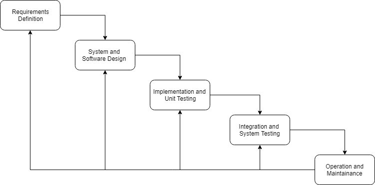
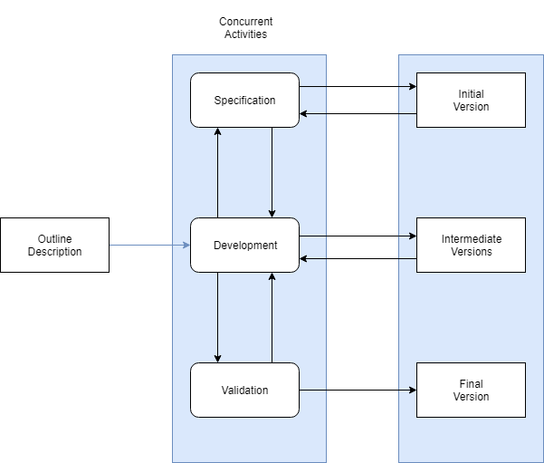
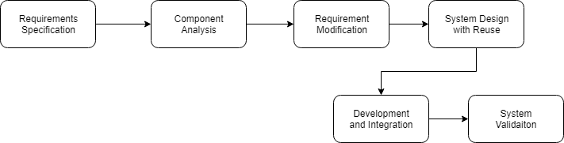
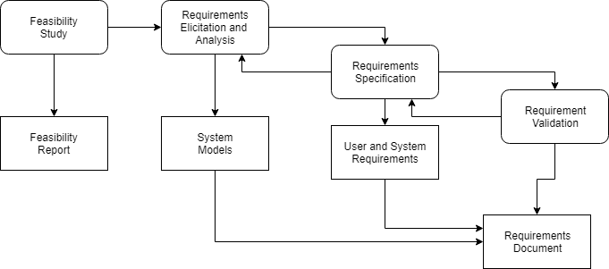
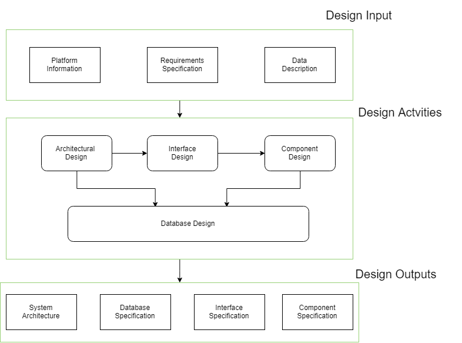
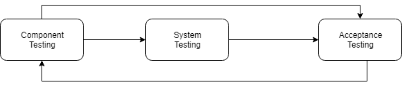
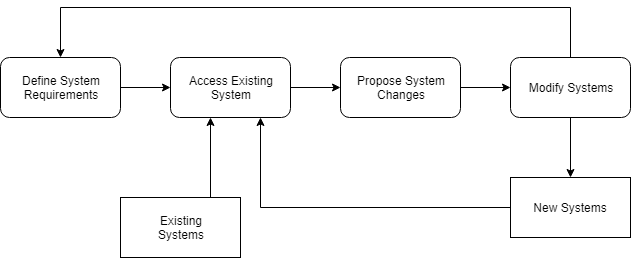

# Introduction to Software Engineering

## *Chapter One: Introduction*

- Because of the lack of physical constraints, software systems can quickly be complex, difficult to understand and expensive to change.
- Many so-called software failures are a consequences of two factors:
    - Increasing demands
    - Low expectations

- Difference between professional and amateur
    - when we are talking about software engineering, software is not just the program themselves but also associated documentation and configuration data correlated to the programs operate correctly.

- Difference between software engineering and computer science
    - computer science focus on theory and fundamentals while software engineering is concerned with the practicalities of developing and delivering useful software.

- Main cost of software engineering
    - 60% development cost and 40% test cost.
    - For custom software, evolution costs often exceed development cost.

- Characteristics needs to be considered to for software engineering
    - *Maintainability*. Software should be written in such a way that is strong to the changing needs of the customers.
    - *Dependability and Security*. A good software should be robust to the physical and economic damage.
    - *Efficiency*. Good Software should not make wasteful use of system resources such as memory and processor cycles.
    - *Acceptability*. Software should be acceptable to the type of users for which it is designed.

- A software is a sequence of activities that leads to the production of a software product. It usually contains four common activities.
    - Software Specification.
    - Software Development.
    - Software Validation.
    - Software Evolution.

- Key Points
    - Software is not just a program or programs but also contains documentation. Essential software product attributes are maintainability, security, efficiency, and acceptability.
    - The fundamental notion of software engineering are universally applicable to all types of system development. The fundamental contains software processes, dependability, security, requirements and reuse.

## *Chapter TWO: Software processes*

- software process is a set of related activities that leads to the production of a software product.
    - Software specification
    - Software design
    - Software validation
    - Software evolution

- sometime the software process are categorized as either plan-driven or agile process.
    - plan-driven processes are processes where all of the process activities are planned in advanced and progress is measured against this plan.
    - In agile processes, planning is incremental and it is easier to change the process to reflect changing customer requirement.

- Software process models
    - *Waterfall model*. This kind of model takes the fundamental process activities of specification, development, validation, and evolution and represents them as separate process phases.

        

    - *Incremental development*. This approach interleaves the activities of specification, development and validation. The system is developed as a series of versions, which each version is adding functionality to the previous version.
        
        
        
        3 advantages
        - Cost of accommodating changing customer requirements is reduced.
        - Easier to custom feedback.
        - More rapid delivery and deployment of useful software is possible.

    - *Reuse-oriented software engineering*. This approach is based on the existence of a significant number of reusable components. The integrating of these components is focus in this process.

        

        - Reuse-orientated software engineering has obvious advantage of reducing the amount of software to be developed and so reducing cost and risks.

- Process activities 
    - Software specification
        - Four main activities in the requirements engineering process.
            - Feasibility study
            - Requirements elicitation and analysis
            - Requirements specification
            - Requirements validation

            

    - Software design and implementation
        
        

    
    - Software validation
        - three-stage testing process
            
            - Development testing
                - The components making up the system are tested by the people developing the system. Each component is tested independently, without other system components.
            - System testing
                - System components are integrated to create a complete system. This process is concerned concerned with finding errors that result from unanticipated interactions between components and component interface problem.
            - Acceptance testing
                - Final stage in the testing process before the system is accepted for operational use. This kind of testing is tested by customer rather than simulated test data to figure out the omissions for the previous testing.

    - Software evolution
        - The flexibility of software systems is one of the main reasons why more and more software is being incorporated in large, complex systems.
        - The distinction between development and maintenance is increasingly irrelevant.

            

- Software Change
    - two related approaches may be used to reduce the costs of rework.
        - Change avoidance
        - Change tolerance
    - two ways of coping with change and changing system requirements.
        - *System prototyping.* This supports change avoidance as it allows users to experiment with the system before delivery and so refine their requirements.
        - *Incremental delivery.* System increments are delivered to the customer for comment and experimentation.

        
